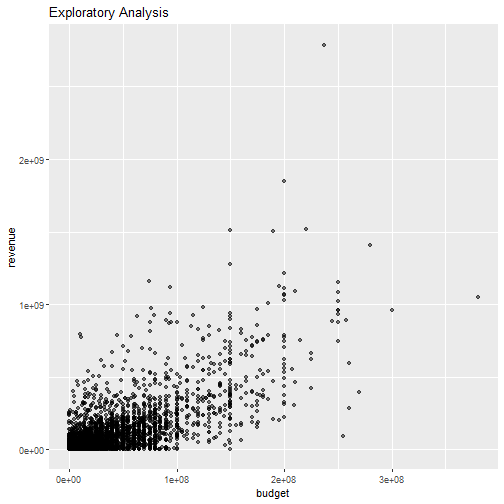
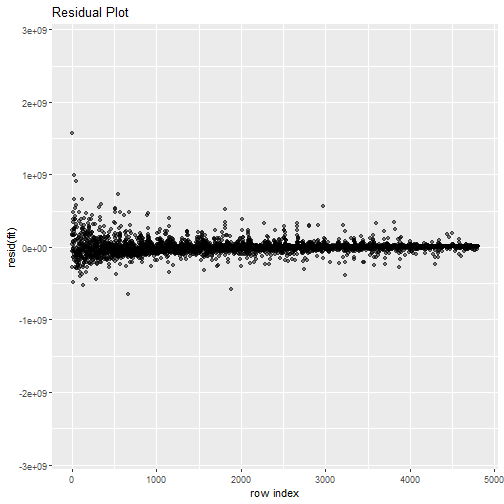

# Summary

This presentaion describes a Shiny Web Application created in the coursera course [Developing Data Products](https://www.coursera.org/learn/data-products).

The application uses [Movie Data](https://www.kaggle.com/tmdb/tmdb-movie-metadata#tmdb_5000_movies.csv) from kaggle.
The data can be explored in a scatter plot and further the revenue can be predicted by selecting the columns, the algorithm and the percentage of data to use for the prediction


---

# Code Example
Exmaple of initial scatter plot used for data exploration.

```r
ggplot(movies, aes(x = budget, y = revenue)) + geom_point(alpha = 0.5) + labs(title = "Exploratory Analysis")
```



---

# Prediction
The prediction is calculated with the train function in the caret package.

```r
fit2 <- train(revenue ~ .,data = trainData, method = input$selectModel)
```

Additional controls on the left can be used to select the columns, the algorithm and the percentage of data, that should be used to predict the revenue of a movie.

# Adjustment and Validation
When a prediction model is calculated, the controls on the left can be adjusted to calculate a new model.
As a validation the R square value and a residual plot is printed.



---

# Links

The application can be used at RPubs with this link:

The Code for the application is uploaded to github:

